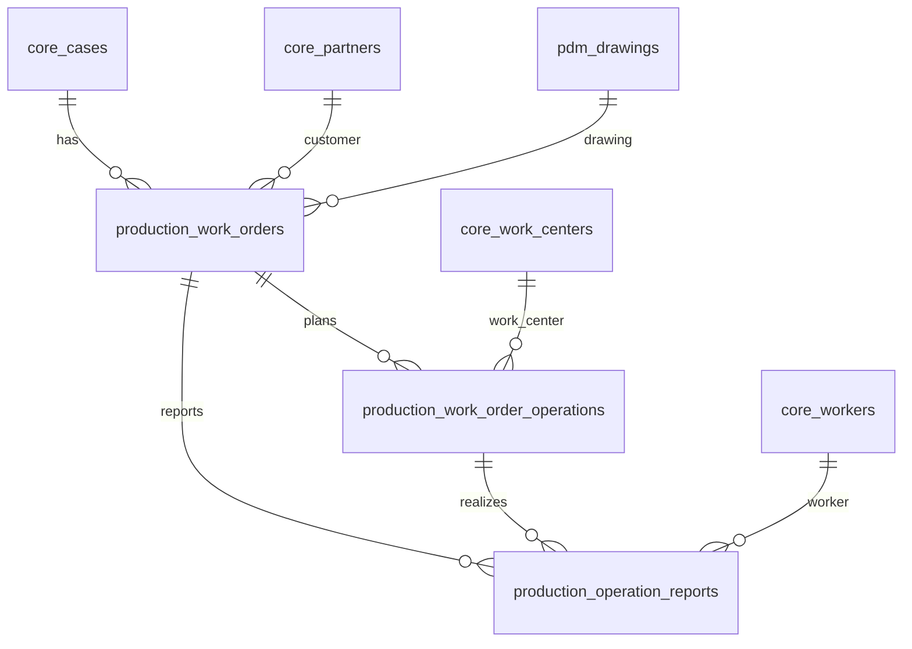
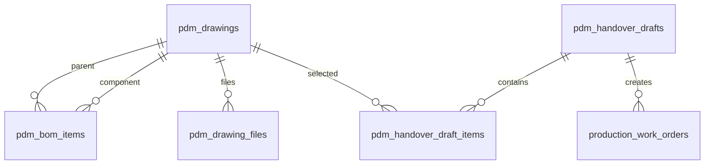

# QBigTehn schema inventory i Postgres pravac

> **Status:** draft v0.1  
> **Datum:** 25. april 2026  
> **Izvor:** `c:\Users\nenad.jarakovic\Desktop\BigbitRaznoNenad\script.sql`  
> **Namena:** prvi strukturisan inventar SQL Server šeme za prelazak na jedan Postgres sistem na Servoteh serveru.

---

## 0. TL;DR

`script.sql` je kompletan SSMS export za `QBigTehn`, ne samo tabela. Automatski inventar daje:

| Objekat | Broj |
|---|---:|
| Tabele | 82 |
| Foreign key veze | 59 |
| Funkcije | 63 |
| Procedure | 51 |
| View-ovi | 9 |
| Trigger-i u exportu | 0 |

Zaključak: ne treba portovati SQL Server šemu 1:1. Treba napraviti **kanonsku Postgres šemu** za novu aplikaciju, uz legacy staging/mapping sloj za migraciju i validaciju. Postojeći `servoteh-plan-montaze` moduli već imaju deo ciljne strukture: kadrovska, plan montaže, lokacije, održavanje, sastanci i plan proizvodnje.

---

## 1. Domeni tabela

### 1.1 Production / RN

Ovo je jezgro budućeg MES-a i mora ući u prvu Postgres fazu.

| Legacy tabela | Predlog Postgres domena | Napomena |
|---|---|---|
| `tRN` | `production.work_orders` | Glavni radni nalog. Čuvati `legacy_idrn`. |
| `tStavkeRN` | `production.work_order_operations` | Planirane operacije po RN-u. |
| `tTehPostupak` | `production.operation_reports` | Realno evidentirani postupci/rad/prijave. |
| `tSaglasanRN` | `production.work_order_approvals` | Workflow odobrenja. |
| `tLansiranRN` | `production.work_order_releases` | Workflow lansiranja. |
| `tRNKomponente` | `production.work_order_components` | Komponente RN-a. |
| `tRNNDKomponente` | `production.work_order_purchased_components` | Nabavni delovi / non-drawing komponente. |
| `tStavkeRNSlike` | `production.work_order_operation_files` | Slike/dokumentacija stavke RN. |
| `tTehPostupakDokumentacija` | `production.operation_report_files` | Dokumentacija uz realizovan postupak. |
| `tPDM`, `tPLP`, `tPND` | `production.legacy_operation_groups` ili migracioni staging | Deluju kao specijalizovane evidencije po tipu rada; proveriti pre kanonizacije. |

Minimalni kanonski model:



---

### 1.2 PDM / crteži / BOM

Ovo je drugi P0 domen jer RN i MRP zavise od crteža i sastavnica.

| Legacy tabela | Predlog Postgres domena | Napomena |
|---|---|---|
| `PDMCrtezi` | `pdm.drawings` | Kanonski crtež: `drawing_no`, `revision`, `legacy_idcrtez`. |
| `KomponentePDMCrteza` | `pdm.bom_items` | BOM relacija: parent drawing -> required drawing. |
| `SklopoviPDMCrteza` | `pdm.assembly_links` | Where-used / sklopovi; verovatno se spaja sa `bom_items`. |
| `PDM_PDFCrtezi` | `pdm.drawing_files` | Uskladiti sa postojećim `bigtehn_drawings_cache` / storage modelom. |
| `PDM_Planiranje` | `pdm.planning_batches` | Planiranje predaje / nabavke iz PDM-a. |
| `PDM_PlaniranjeStavke` | `pdm.planning_items` | Stavke planiranja. |
| `NacrtPrimopredaje` | `pdm.handover_drafts` | Nacrt primopredaje crteža/proizvodnje. |
| `NacrtPrimopredajeStavke` | `pdm.handover_draft_items` | Stavke nacrta, duplikati i odluke. |
| `PrimopredajaCrteza` | `pdm.drawing_handovers` | Realna primopredaja crteža. |
| `PrimopredajaPDFCrteza` | `pdm.drawing_handover_files` | PDF-ovi uz primopredaju. |
| `StatusiCrteza` | `pdm.drawing_statuses` | Šifarnik. |
| `StatusiPrimopredaje` | `pdm.handover_statuses` | Šifarnik. |
| `StatusiNacrtaPrimopredaje` | `pdm.handover_draft_statuses` | Šifarnik. |
| `PDMXMLImportLog` | `pdm.import_log` | Log CAD/XML import-a. |

Kanonski BOM model treba da bude rekurzivan, bez hardkodovanih nivoa `Sklop/PodSklop/PodPodSklop`.



---

### 1.3 Partneri, predmeti i komercijalni kontekst

Ovo je `core` domen, deljen između proizvodnje, planiranja, sastanaka i izveštaja.

| Legacy tabela | Predlog Postgres domena | Napomena |
|---|---|---|
| `Predmeti` | `core.cases` ili `core.projects` | Ne mešati direktno sa postojećim `projects` iz plana montaže; treba mapping. |
| `Komitenti` | `core.partners` | Kupci, dobavljači, vozači kroz isti legacy pojam. |
| `Prodavci` | `core.salespeople` ili `core.users_legacy` | Proveriti da li realno treba u novoj app. |
| `PredmetiVrstaPosla` | `core.case_work_types` | Šifarnik tipova posla. |
| `UplatniRacuni` | `finance.payment_accounts_legacy` | Faza 3 ili read-only. |
| `Vrste sifara` | `core.partner_types` | Problematično ime sa razmakom. |

Bitna odluka: postojeći `projects` u `servoteh-plan-montaze` je operativni plan montaže, dok je `Predmeti` legacy poslovni predmet/ugovor/narudžba. Treba uvesti jasnu vezu:

```text
core.cases.legacy_idpredmet -> production.work_orders.case_id
planning.projects -> optional case_id / legacy_idpredmet
meetings.projekt_bigtehn_rn -> zameniti eksplicitnim FK ka case/work_order gde je moguće
```

---

### 1.4 Radnici, operacije i radni centri

Ovo je `core` + `production` master-data sloj.

| Legacy tabela | Predlog Postgres domena | Napomena |
|---|---|---|
| `tRadnici` | `core.workers` | Spojiti sa postojećim `employees` gde ima isti čovek. |
| `tVrsteRadnika` | `core.worker_types` | Šifarnik. |
| `tOperacije` | `core.work_centers` / `production.operation_catalog` | Sadrži `RJgrupaRC`; verovatno i mašine i operacije. |
| `tOperacijeFix` | staging / audit | Deluje kao pomoćna/fix tabela; proveriti. |
| `tPristupMasini` | `production.work_center_access` | Ko sme/pristupa kojoj mašini. |
| `tRadneJedinice` | `core.work_units` | Šifarnik RJ. |
| `tVrsteKvalitetaDelova` | `quality.quality_types` | Već postoji cache u Supabase kao `bigtehn_quality_types_cache`. |

Važno: u trenutnom Postgres/Supabase sistemu već postoje `bigtehn_workers_cache`, `bigtehn_machines_cache`, `bigtehn_worker_types_cache`, `bigtehn_quality_types_cache`. Za on-prem Postgres, ovo više ne treba da bude samo cache nego kanonski master-data sloj.

---

### 1.5 Lokacije delova

Postojeći `servoteh-plan-montaze` već ima zreliji `loc_*` model od starog `tLokacijeDelova`, posebno zbog mobilnog toka, outbox-a i audit-a.

| Legacy tabela | Predlog Postgres domena | Napomena |
|---|---|---|
| `tLokacijeDelova` | migrirati u `inventory.part_movements` / `loc_location_movements` | Ne kopirati 1:1; mapirati na postojeći lokacijski model. |
| `tPozicije` | `inventory.positions` | Šifarnik pozicija. |
| `Nalepnice` | `inventory.labels` ili generisano iz podataka | Proveriti da li je potrebna tabela ili samo print log. |

Preporuka: novi Postgres model treba da zadrži postojeći koncept:

```text
locations
location_movements
item_placements
sync/outbox samo ako ostaje neki eksterni sistem
```

Ako `QBigTehn` postaje read-only arhiva posle migracije, Supabase -> MSSQL outbox više ne treba za stalni rad.

---

### 1.6 MRP, artikli, magacin i robna dokumenta

Ovo je najveća zona za scope control. Deo je potreban za proizvodnju, ali kompletno knjigovodstvo i fakturisanje ne treba uvlačiti u Fazu 2.

| Legacy tabela | Predlog Postgres domena | Napomena |
|---|---|---|
| `MRP_Potrebe`, `MRP_PotrebeStavke` | `mrp.requirements`, `mrp.requirement_items` | P0/P1 ako MRP prelazi u novu app. |
| `MRP_StanjeArtikala`, `MRP_StanjeArtikala_TMP`, `MRP_SyncStatus` | `mrp.item_stock_snapshots` / sync log | Verovatno izvedeni podaci. |
| `R_Artikli` | `inventory.items` | Master artikala. |
| `R_Grupa`, `R_Podgrupa`, `R_Poreklo` | `inventory.item_groups`, `item_subgroups`, `item_origins` | Šifarnici. |
| `R_Tarife` | `finance.tax_rates_legacy` | Potrebno samo ako računovodstvo ostaje u opsegu. |
| `Magacini` | `inventory.warehouses` | P0/P1 za proizvodni magacin. |
| `RobnaDokumentaMirror`, `RobneStavkeMirror` | staging / read-only bridge ka BigBit | Mirror, ne kanonski dokument ako BigBit ostaje izvor. |
| `T_Robna dokumenta`, `T_Robne stavke` | Faza 3 / legacy archive | Ima razmake i računovodstveni scope. |
| `R_Vrste dokumenata` | Faza 3 / `inventory.document_types` | Problematično ime i širok finansijski kontekst. |
| `Cenovnik` | Faza 3 / `sales.price_lists` | Van P0 ako nema prodaje/fakturisanja u novoj app. |

Za Fazu 2 bih uzeo samo ono što treba proizvodnji:

```text
inventory.items
inventory.warehouses
inventory.stock_snapshots
mrp.requirements
mrp.requirement_items
```

Robna dokumenta i fakture ostaviti kao read-only legacy ili BigBit integraciju, dok se ne odluči Faza 3.

---

### 1.7 Sistem, konfiguracija, prava i audit

Ovaj deo ne treba portovati 1:1. Treba preneti samo koncepte.

| Legacy tabela | Novi pristup |
|---|---|
| `_Dnevnik` | Zameniti postojećim `audit_log` patternom iz repo-a. |
| `_RegAccess`, `_RegApps`, `_RegUsers`, `_RegUsersApps` | Zameniti normalnim `auth.users`, `app_users`, `user_roles`, session/audit logom. |
| `BBDefUser`, `BBPravaPristupa`, `BBOdeljenja`, `BBOrgJedinice` | Migrirati samo aktivne korisnike/role/OJ/OD ako su realno potrebni. |
| `CFG_Global`, `CFG_Sys`, `Parametri za rad` | Prevesti u `app_settings` samo za parametre koji postoje u novoj aplikaciji. |
| `Radni fajlovi` | Legacy company/config tabela; ne portovati direktno. |
| `T_Planer`, `T_PlanerGrupeUsera` | Verovatno zamenjuje modul `sastanci` / notifikacije; proveriti. |

---

## 2. Problemi u SQL Server šemi

### 2.1 Imena koja nisu pogodna za Postgres

Tabele sa razmacima:

| Legacy ime | Predlog |
|---|---|
| `Parametri za rad` | `app_settings_legacy` ili ne portovati |
| `R_Vrste dokumenata` | `inventory.document_types` |
| `Radni fajlovi` | `core.companies_legacy` ili ne portovati |
| `T_Robna dokumenta` | `inventory.goods_documents_legacy` |
| `T_Robne stavke` | `inventory.goods_document_lines_legacy` |
| `Vrsta naloga` | `production.order_types` |
| `Vrste sifara` | `core.partner_types` |

Kolone takođe masovno koriste PascalCase, srpska imena i razmake. To je očekivano za Access/SQL Server, ali u novoj šemi treba standard:

```text
legacy: IDPredmet, BrojPredmeta, DatumOtvaranja, SifraRadnika
target: legacy_idpredmet, case_no, opened_at, worker_id
```

### 2.2 Tipovi koje treba očistiti

Najčešći tipovi u exportu:

| SQL Server tip | Broj kolona | Postgres smer |
|---|---:|---|
| `nvarchar` | 401 | `text` ili `varchar(n)` samo gde postoji realno ograničenje |
| `int` | 251 | `integer`, a za nove PK `bigint generated` ili `uuid` po odluci |
| `bit` | 118 | `boolean` |
| `datetime` | 92 | `timestamptz` za događaje, `date` za poslovne datume bez vremena |
| `float` | 70 | `numeric(...)` za mere/težine/novac gde treba preciznost |
| `money` | 16 | `numeric(14,2)` ili domen-specifičan `numeric(18,4)` |
| `ntext` | 11 | `text` |
| `image` | 2 | fajl storage + metadata tabela, ne `bytea` osim ako mora |

### 2.3 Proceduralna logika

U exportu ima 63 funkcije i 51 procedura. Ne treba sve prevoditi u PL/pgSQL. Podela:

| Tip | Primeri | Smer |
|---|---|---|
| Jednostavni helperi | `fsBrojSekundiUIntervalu`, `fsDatumUIntervalu` | Uglavnom ne portovati; rešava aplikacija/SQL izraz. |
| Pregledi/report funkcije | `ftPregledPoPostupcima`, `ftPregledRNPoPredmetima` | Prevesti u view/RPC samo za aktivne ekrane. |
| BOM/MRP logika | `ftBOMKolicine`, `ftMRP_*`, `ftWhereUsed` | Portovati pažljivo, verovatno kao rekurzivne CTE query-je. |
| Workflow/generisanje brojeva | `fsSledeciBrojRadnogNaloga`, `fsSledeciBrojNacrtaPrimopredaje` | Zameniti sekvencama i transakcionim servisima. |
| Legacy/Access podrška | config/read helpers, proverava trigere itd. | Ne portovati. |

---

## 3. Predlog Postgres organizacije

Jedna baza, više šema:

| Schema | Svrha |
|---|---|
| `core` | firme, korisnici, radnici, partneri, predmeti, organizacija |
| `production` | RN, operacije, prijave rada, workflow, kvalitet |
| `pdm` | crteži, BOM, fajlovi, primopredaja crteža |
| `inventory` | artikli, magacini, lokacije, zalihe, proizvodni materijal |
| `mrp` | potrebe, rezervacije, proračuni nedostajućeg materijala |
| `planning` | postojeći plan montaže i plan proizvodnje overlays |
| `maintenance` | održavanje mašina |
| `hr` | kadrovska i obračuni iz postojećeg modula |
| `meetings` | sastanci i akcioni plan |
| `audit` | audit log, event log |
| `legacy` | staging tabele za one-off import i validaciju |

Pravilo: `legacy` sme da liči na SQL Server, sve ostalo mora biti čista nova šema.

---

## 4. Minimalni P0 model

Prvi izvršivi DDL ne treba da pokrije svih 82 tabela. P0 treba da pokrije rad sistema bez Access-a za pogonsku operativu:

### Core

```sql
create schema if not exists core;
create schema if not exists production;
create schema if not exists pdm;
create schema if not exists inventory;
create schema if not exists mrp;
create schema if not exists audit;
create schema if not exists legacy;
```

P0 tabele:

| Target tabela | Legacy izvor |
|---|---|
| `core.partners` | `Komitenti` |
| `core.cases` | `Predmeti` |
| `core.workers` | `tRadnici` + postojeći `employees` |
| `core.work_units` | `tRadneJedinice` |
| `core.work_centers` | `tOperacije` / `bigtehn_machines_cache` |
| `pdm.drawings` | `PDMCrtezi` |
| `pdm.bom_items` | `KomponentePDMCrteza`, `SklopoviPDMCrteza` |
| `production.work_orders` | `tRN` |
| `production.work_order_operations` | `tStavkeRN` |
| `production.operation_reports` | `tTehPostupak` |
| `production.work_order_approvals` | `tSaglasanRN` |
| `production.work_order_releases` | `tLansiranRN` |
| `inventory.locations` | postojeći `loc_locations` + `tPozicije` |
| `inventory.location_movements` | postojeći `loc_location_movements` + `tLokacijeDelova` |

---

## 5. Odnos prema postojećem `servoteh-plan-montaze`

Postojeći repo ne bacati. On već rešava module i pravila koja ulaze u novi sistem:

| Postojeći deo | Novi status |
|---|---|
| `sql/schema.sql` | Izvor za `planning`, `hr`, `audit`, deo `auth/rbac` patterna. |
| `sql/migrations/add_loc_*` | Najbolja osnova za novi lokacijski model. |
| `sql/migrations/add_plan_proizvodnje.sql` | Osnova za production planning overlays. |
| `bigtehn_*_cache` koncept | Privremeno koristan za migraciju; posle one-off migracije kanonske tabele ga zamenjuju. |
| `workers/loc-sync-mssql` | Pattern za outbox/retry, ali neće biti stalni smer ako MSSQL odlazi u arhivu. |
| `docs/SUPABASE_PUBLIC_SCHEMA.md` | Snapshot live Supabase šeme, koristan za poređenje. |

Ključna promena: danas je `bigtehn_*_cache` read-only cache iz MSSQL-a; u novoj Postgres aplikaciji odgovarajuće tabele treba da postanu **kanonski izvor**.

---

## 5b. Lokacije modul — validan obrazac za Fazu 2 inventory domen

Hardening sprintovi LOC-Härd-1 do Härd-4 (commits `33c6d7b`, `620e6ca`, `3e4ca5b`, `37454aa`, 2026-05-15) konsolidovali su **obrasce** koje treba primeniti i u Fazi 2 inventory domenu (`inventory.placements`, `inventory.movements` i ostatak):

| Obrazac | Implementacija u Härd-1..H-4 | Primena u Fazi 2 |
|---|---|---|
| **RPC-only writes** | INSERT u `loc_location_movements` ide isključivo kroz `loc_create_movement(payload jsonb)` SECURITY DEFINER. RLS bez INSERT policy na movements. | Sva pisanja inventory pokreta moraju ići kroz RPC; klijenti nikad ne diraju tabelu direktno. |
| **Client-generated idempotency UUID** | `client_event_uuid` UUID v4 — partial UNIQUE indeks; replay vraća `idempotent:true` umesto duplikata. | Svaki RPC koji prihvata payload sa klijenta dobija `client_event_uuid` polje (opcioni); RPC generiše ako klijent ne pošalje. Reversi i Štampa nalepnica koriste isti obrazac kroz wrapper u `services/lokacije.js`. |
| **Advisory lock na bucket** | `pg_advisory_xact_lock(hashtextextended(item:order))` serijalizuje paralelne pozive za isti bucket. | Za inventory.movements bucket je `(sku × location × cost_center)` ili sl. domen-specifičan ključ. |
| **Outbox + MSSQL sync** | `loc_sync_outbound_events` (PENDING → IN_PROGRESS → SYNCED/FAILED → DEAD_LETTER) sa FOR UPDATE SKIP LOCKED. Exp. backoff 2..360 min. Posle 10 attempts → DEAD_LETTER. | Faza 2 inventory može da zadrži isti pattern dok god MSSQL ostaje pisani write-back target. Kad MSSQL ode u arhivu, outbox postaje mrtav kod i briše se. |
| **Worker heartbeat + DEAD_LETTER digest** | `loc_sync_worker_heartbeat` + pg_cron job `loc_sync_health_check_hourly` koji enqueue-uje mejlove admin-ima (`user_roles.role IN ('admin','menadzment')`). Dedup ključ po danu + worker_id. | Bilo koji backend worker u Fazi 2 (`inventory-sync-mssql`, `production-bridge`, itd.) dobija isti heartbeat obrazac. Admin emails se ne čuvaju u novoj konfiguracionoj tabeli — recikliraju se iz `user_roles`. |
| **Hijerarhijski path_cached + cycle guard** | `loc_locations_guard_and_path` trigger sprečava cikluse (CTE do 200 nivoa), recompute path_cached i depth-a pri INSERT/UPDATE parent/name. AFTER trigger rekurzivno ažurira potomke. | Faza 2 inventory ima sličnu HALA → POLICA → SUB-LOKACIJA hijerarhiju (regal/red/polica). Pattern direktno primenljiv. |
| **Business hierarchy enforcement** | `loc_locations_enforce_business_hierarchy` trigger forsira da HALA mora biti root, POLICA mora imati HALU za parent. Tipovi su u jednom enum-u (`loc_type_enum`), poslovna pravila u trigger-u. | Faza 2 — isti pattern: enum za sve tipove lokacija, trigger čuva business invariante. |
| **Email-based role check** | `loc_can_create_movement()` koristi `lower(auth.jwt()->>'email') = lower(employees.email)` (a NE `auth.uid()` ili `employees.auth_user_id` — to polje ne postoji u šemi). Obrazac konzistentan sa pb4_rls, maint, sastanci. | Faza 2 isto. Ako se kasnije migrira na `auth_user_id`, treba migracioni helper koji bi popunio retroaktivno. |
| **AbortController + signal kroz sbReq** | `sbReq` u `services/supabase.js` prihvata `options.signal`; `AbortError` se propagira pozivaocu. UI Predmet tab koristi `AbortController` sa 30s timeout-om. | Sva Faza 2 UI komponenta koja radi `Promise.all([...])` dobija isti pattern. |
| **`escHtml` + CSV injection escape** | Konzistentan `escHtml` u svim UI render-ima; `toCsvField` prefiksuje `'` opasne stringove. | Faza 2 reuse-uje `src/lib/csv.js` i `src/lib/dom.js`. |
| **Modul disposers** | `_lokDisposers` niz + `teardownModule` izvršava sve disposere. Sprečava listener kumulaciju pri SPA re-mount-u. | Svaki modul u Fazi 2 koji vezuje document/window listenere dobija isti pattern. |
| **Migration order runbook** | `docs/migration/loc_migration_order.md` daje 21-step tabelu sa zavisnostima i rollback skriptama. | Svaki domen u Fazi 2 dobija svoj `XX-domain_migration_order.md`. |

**Anti-pattern koje izbegavamo (iz Lokacije nauke):**
- Direktni INSERT iz klijenta u write-tabele bez SECURITY DEFINER RPC-a (RLS-only nije dovoljan).
- Tihi `WHEN others` u RPC-u — eksplicitno hvatamo `unique_violation`, `check_violation`.
- `auth.uid()` only auth — uvek pratimo email obrazac da bi role check radio kroz `user_roles.email`.
- "Admin emails" kao nova konfiguraciona tabela — koristimo `user_roles` filter.
- Trigger AFTER da radi business validaciju — kapacitet check ide u RPC pod advisory lock-om, trigger samo upserts placement.
- Long-lived setInterval/setTimeout bez clearAtCleanup-a — sve disposers idu u centralni niz.

---

## 6. Sledeći konkretni koraci

1. Proširiti parser da izvuče PK, FK i unique constraint-e u JSON/Markdown.
2. Napraviti `legacy -> target` mapping CSV za P0 tabele.
3. Napisati prvi `db_schema_baseline.sql` za `core`, `production`, `pdm`, `inventory`.
4. Napraviti ER dijagrame po domenima: `core+production`, `pdm+bom`, `inventory+locations`, `planning`.
5. Definisati migracionu strategiju: `legacy.*` staging import, validacioni query-ji, zatim insert u kanonske tabele.

Komanda za ponavljanje inventara:

```bash
python scripts/analyze_qbigtehn_schema.py
```
