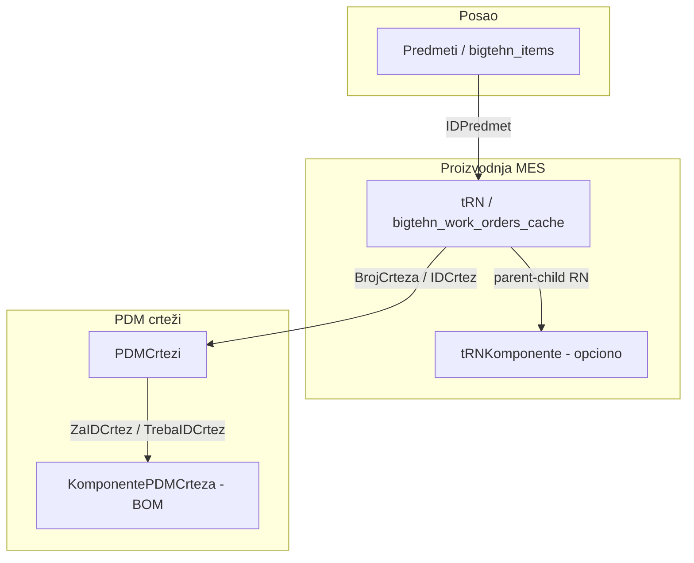
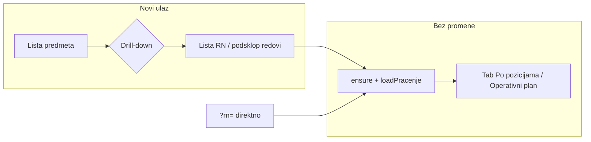

# Aktivni predmeti — redizajn ulaza u Praćenje proizvodnje (analiza i plan)

> **Status:** plan za odobrenje (bez implementacije)  
> **Datum:** 25. april 2026; **dopunjeno:** primarni DDL, PDM pregled crteža, integrisani model predmet/sklop/podsklop/part (april 2026)  
> **Ograničenje:** nema SQL migracija u okviru ovog dokumenta; implementacija u posebnom koraku.  
> **Vezani dokumenti:** `docs/migration/07-pdm_pregled_crteza_veze_i_prenos.md` (PDM BOM, `KomponentePDMCrteza`, `ftPDMSklopConectorPregled`).

**Primarni izvor šeme (u repou):** `docs/migration/QBigTehn_MSSQL_full_ssms_export_2026-04-10.sql` (SSMS export; vidi `QBigTehn_MSSQL_full_ssms_export_2026-04-10.README.md`). Linije ispod se odnose na taj fajl.

---

## 1. Sažetak izmene

| | Staro (trenutno) | Novo (cilj) |
|---|---|---|
| **Prvi ekran** | Jedan red po **radnom nalogu** (`v_active_bigtehn_work_orders`) | Jedan red po **predmetu** (`bigtehn_items_cache` / `item_id`) koji ima bar jedan aktivan MES RN |
| **Kolone** | Red, broj predmeta (iz itema), naziv (`naziv_dela` sa RN), komitent | **Redni broj**, **naziv predmeta** (+ po želji prikaz `broj_predmeta`), **komitent**, **badge broj podsklopova** |
| **Ulaz u praćenje** | Klik na RN → `ensure` + učitavanje po RN | Klik na **predmet** → prikaz **podsklopova** → klik na podsklop (RN) → isti postojeći tok (Tab „Po pozicijama” / Inkrement 2) |
| **Prioritet sorta** | Nema | Globalni `sort_priority` u novoj tabeli; **menja samo admin** |

**Šta ostaje netaknuto:** Unutrašnjost modula nakon izbora RN-a (Tab 1 / Tab 2, `get_pracenje_rn`, `ensure_radni_nalog_iz_bigtehn`, real-time) — samo **ulazna tačka** i navigacija se pomera.

**Jedan plan (gde je sve sabrano):** Pojam po pojmu (*predmet → MES sklop/podsklop → PDM part*), tabela *odakle šta preuzimamo* i prioritet P0/P1/P2, plus dijagram — **§1A**. Kako urediti *Praćenje* (prioritet, RPC, dva ekrana, mapiranje starog fronta) — **§4–8**. PDM/BOM (crtež–crtež, nije u istoj listi kao RN) — **`07-pdm_…`**. Otvorena pitanja (npr. `XX`) — **§9**; faze (Faza 0 / A / B / C / PDM) — **§10**; dijagram ulaza — **§11**.

---

## 1A. Integrisani model: **predmet → sklop → podsklop → part** (odakle šta i šta prenosimo)

U BigTehn-u ovi termini **nisu jedna tabela** — to su **nivoi u tri paralelna domena** (posao / proizvodnja / PDM). Za modul *Praćenje* važno je ne mešati **MES listu (RN)** sa **inženjerskom sastavnicom (crtež)**, osim u sledećem deljenju uloga.

### 1A.1 Pojmovi (jedan–drugi red u tabeli = različit izvor)

| Pojam | Značenje (ovaj plan) | Gde u MSSQL (QBigTehn) | Šta je u Supabase sada | Prvo u *Praćenju* (MVP) |
|--------|----------------------|-------------------------|-------------------------|-------------------------|
| **Predmet** | Poslovni predmet (ugovor, jedna stavka u registru) | `Predmeti` / `IDPredmet` | `bigtehn_items_cache` (`id` = legacy `IDPredmet`) | **Ekran 1:** jedan red po `item_id` (MES-aktivni RN) |
| **Sklop (proizvodni / MES)** | U praksi: glavni tok RN za taj predmet, ili nivo u **RN strukturi** (više `tRN` vezanih u `tRNKomponente`) | `tRN` (svaki RN = jedan nivo proizvodnje; glavno polje: `IDPredmet`, `IdentBroj`, `BrojCrteza`) | `bigtehn_work_orders_cache` + `v_active_bigtehn_work_orders` | **Ekran 2:** svaki MES-aktivni RN pod predmetom = „red podsklopa" u reči korisnika (MVP) |
| **Podsklop (reč u UI)** | U najužem inženjerskom smislu: **dečji RN** u `tRNKomponente` (parent→child `IDRN`); u širem: **bilo koji drugi RN** istog predmeta (drugi deo `IdentBroja` / drugi TP) | **(b)** više `tRN` isti `IDPredmet`; **(c)** `tRNKomponente(IDRN, IDRNPodkomponenta)` | (b) **da**; (c) **nije** u cache-u (potreban sync) | **MVP = (b)**; (c) kasnije ako treba ista logika kao `ftStrukturaProizvodaZaIzvestaj` |
| **Part / deo (PDM, crtež)** | Komponenta u **BOM**—crtež-dete u sastavnici sklopa; često .SLDPRT; „broj referenci" u *PDM Pregledu* = `COUNT` d dece u `KomponentePDMCrteza` | `PDMCrtezi` (master crteža) + **`KomponentePDMCrteza` (`ZaIDCrtez` → `TrebaIDCrtez`)**; grid kao `ftPDMSklopConectorPregled` | `bigtehn_drawings_cache` (delimično); **BOM nije** (vidi 07) | **Ne ulazi u MVP ulaza u Praćenje**; prenos u posebnoj **Fazi PDM** (tabela 07) |
| **Operacija (TP)** | Tehnološki korak *unutar* jednog RN-a | `tStavkeRN`, stvarne prijave: `tTehPostupak` | `bigtehn_work_order_lines_cache`, itd. | Unutra modula, kao sada (Tab 1) |

**Pravilo razdvajanja:**  
- **Predmet** = šifra posla (`broj_predmeta` / `item_id`).  
- **„Sklop" u reči planera** na ekranu predmeta = često **jedan RN** ili **složena stvar od više RN** — u MVP-u to **realizujemo kao listu RN-ova (b)**, ne kao PDM stablo.  
- **„Part"** = **crtež u PDM**; lista komponenti = **`KomponentePDMCrteza`**, ne `Predmeti`.

### 1A.2 Otkuda šta prenositi (i redosled)

| Prioritet | Šta | Odakle (izvor) | Cilj (Supabase) | Napomena |
|-----------|-----|----------------|-----------------|----------|
| **P0 (već živi)** | RN, predmet, MES aktivan | `tRN` + `Predmeti` (preko bridge-a) | `bigtehn_work_orders_cache`, `bigtehn_items_cache`, `production_active_work_orders` | Oslonac za ekran 1 i 2 + `ensure_radni_nalog_iz_bigtehn` |
| **P1 (ovaj modul — backend iz §4–6)** | Prioritet reda predmeta, lista predmeta, drill RN | nove tabele / RPC u `production` + view na cache | Kao u §4–6 | |
| **P0b (po izboru)** | Struktura RN–RN (pravi podsklop u smislu komponente) | `tRNKomponente` | npr. `bigtehn_rn_components_cache` | Samo ako treba (c) |
| **P2 (PDM)** | BOM crtež–crtež, broj ref., `+` na sklopu | `PDMCrtezi` + `KomponentePDMCrteza` (+ `ftPDMSklopConectorPregled` za istu logiku) | tabela + sync opis u **07** | Ne blokira *Praćenje* MVP |

### 1A.3 Dijagram domena (pojednostavljen)

Veza **predmet ↔ PDM** ide preko **RN** (`tRN.IDCrtez` / `BrojCrteza` → `PDMCrtezi`), ne preko zasebnog parent polja u `Predmeti`.

### 1A.4 Šta korisnik vidi u „Praćenju" (MVP) vs budućnost

- **MVP (usvojeno u ovom planu):** ekran 1 = **predmeti**; ekran 2 = **svi MES-aktivni RN-ovi** tog `item_id` (semantika **(b)**), labela `…/XX` posle potvrde iz §9.  
- **Buduće:** (c) ograničiti drill na stablo iz `tRNKomponente`; (PDM) panel „sastavnica crteža" iz `KomponentePDMCrteza` (bez mešanja u istu tabelu sa RN listom, osim jasne druge staze: akcija „Otvori PDM" / tooltip `BrojCrteza`).

---

## 2. Rezultati istraživanja: parent/child u BigTehn-u

Integrisana mapa pojmova (predmet / MES / PDM) i tabela prenosa: **§1A**. Odeljak 2 donosi detalj po tabeli iz primarnog DDL-a.

### 2.1 Primarni DDL u repou

- Fajl: `docs/migration/QBigTehn_MSSQL_full_ssms_export_2026-04-10.sql` (prethodno `Desktop\…\script.sql`).  
- Isti sadržaj: pun SSMS skript baze QBigTehn (10-04-26 u headeru); ~6.2 MB.  
- Sekundarni izvori i dalje važe: `docs/bridge/01-current-state.md`, `05-pracenje-proizvodnje-analiza.md`, `QMegaTeh_Dokumentacija.md`.

### 2.2 `dbo.Predmeti` — potvrđen `CREATE TABLE` (nema parent/child među predmetima)

U DDL-u (linije **1731–1774** u `QBigTehn_MSSQL_full_ssms_export_2026-04-10.sql`) tabela `Predmeti` sadrži m.in.:

`IDPredmet`, `BrojPredmeta`, `Opis`, `DatumOtvaranja`, `IDProdavac`, `IDKomitent`, `NextAction`, `DatumZakljucenja`, `Memo`, `Status`, kontakt/telefoni reference, vrednosna polja (`NabavnaVrednost`, `Carina`, …), `RJ`, `IDVrstaPosla`, `NazivPredmeta`, `RokZavrsetka`, `Potpis`, `DatumIVreme`, `BrojUgovora`, `DatumUgovora`, `BrojNarudzbenice`, `DatumNarudzbenice`.

- **Nema** kolone tipa `IDNadređenog`, `IDGlavniPredmet`, `ParentID` ili slično.  
- U sekciji FK-ova (npr. oko 8143–8234) druge tabele **referenću** `Predmeti.IDPredmet`; **nema** self-referentnog `FOREIGN KEY` na `Predmeti` samu sebe (provera grep-om po `[Predmeti]` u delu `ALTER TABLE … FOREIGN KEY`).

**Zaključak (a):** hijerarhija **„pod-predmet u okviru iste tabele Predmeti"** u ovom skriptu **ne postoji** — opcija (a) iz prethodne analize je **odbačena** na osnovu DDL-a, ne zbog nedostatka podataka u repou.

### 2.3 `dbo.tRN` (radni nalog)

`CREATE TABLE` na linijama **1660–1700** u `QBigTehn_MSSQL_full_ssms_export_2026-04-10.sql`. Bitno:

- `IDRN` (PK, identity), `IDPredmet` (NOT NULL) — veza na poslovni predmet.
- `IdentBroj` (nvarchar 50, NOT NULL), `Varijanta` (int, NOT NULL).
- `NazivDela`, `BrojCrteza`, `Materijal`, `RokIzrade`, `DIVUnosaRN` / `DIVIspravkeRN`, `StatusRN`, `IDStatusPrimopredaje`, itd.

U Supabase se `IdentBroj` već tretira kao `predmet/TP` u `add_loc_tps_for_predmet_rpc.sql` (`split_part(..., '/', 1|2)`).

**Interpretacija (b):** Više redova u `tRN` sa **istim `IDPredmet`**, **različitim** `IdentBroj` = više proizvodnih RN-ova pod istim poslovnim predmetom; odgovara `bigtehn_work_orders_cache.item_id` + `ident_broj`.

### 2.4 `dbo.tStavkeRN`

`CREATE TABLE` linije **1922–1940**: `IDStavkeRN`, `IDRN`, `Operacija`, `RJgrupaRC`, `OpisRada`, `Prioritet`, itd. — stavke **unutar jednog RN-a**; **nije** zaseban radni nalog niti red u `Predmeti`.

### 2.5 `dbo.tRNKomponente` (interpretacija (c))

`CREATE TABLE` linije **2663–2678**:

- `IDKomponente` (PK identity), `IDRN` (parent RN), `IDRNPodkomponenta` (RN koji je deo strukture), `BrojKomada`, `Napomena`.
- `UNIQUE (IDRN, IDRNPodkomponenta)`.

Eksplicitni **FK** u skriptu (linije **8331–8333**): `FK_tRNKomponente_ParentRN` — `IDRN` → `tRN.IDRN`. **Nema** u istom odlomku drugog `ALTER TABLE` koji nameće `FOREIGN KEY` na `IDRNPodkomponenta` → `tRN`; u SQL pročedurama se ipak `JOIN`-uje `tRN pod ON pod.IDRN = k.IDRNPodkomponenta` (npr. oko 1570) — deča RN se tretira kao red u `tRN`.

**Zaključak (c):** Strukturalna veza „glavni RN / pod-RN" postoji u **`tRNKomponente`**; to je **sloj (c)**, nezavisan od (b) više TP-ova pod istim `IDPredmet`. Sync u `backfill-production-cache.js` **ne** uključuje `tRNKomponente` — za filtriranje podsklopova po (c) potrebna je **Faza 0** (cache ili direktan upit).

### 2.6 Koja interpretacija (a)–(d) važi?

| Opcija | Značenje | Dostupnost u Supabase cache-u danas |
|--------|-----------|--------------------------------------|
| **(a)** | Odvojen red u `Predmeti` sa parent FK | **NE** — `CREATE TABLE Predmeti` nema parent kolonu; usklađeno i sa `bigtehn_items_cache` (nema `parent_item_id`) |
| **(b)** | Više RN (isti `IDPredmet`, drugačiji `ident_broj` / TP) | **DA** — `v_active_bigtehn_work_orders` + `item_id` |
| **(c)** | `tRNKomponente`: glavni RN → pod-RN | **Tabela nije** u trenutnom opisu sync-a u `workers/loc-sync-mssql/scripts/backfill-production-cache.js` (sync: `tRN`, `tStavkeRN`, `tTehPostupak`, … **bez** `tRNKomponente`) |
| **(d)** | PDM hijerarhija (crtež–crtež u sastavnici) | `KomponentePDMCrteza` + `PDMCrtezi` (vidi **§1A** i `07-pdm_…`); **nije** u Supabase — za poseban PDM prenos, ne za MVP drill RN |

### 2.7 Preporuka za **prvi nivo** „klik na predmet → vidi podsklopove"

**Koristiti (b) kao primarni izvor redova u drill-downu:**

- Za dati `item_id`, lista svih **MES-aktivnih** RN-ova:  
  `v_active_bigtehn_work_orders` WHERE `item_id = :id` (i `item_id IS NOT NULL`).
- Redosled i labela `Predmet/XX` — vidi sekcija 6 (ne sme se implementirati labela bez korisničke potvrde semantike).

**(c) kao Faza 0 / naredni nivo točnosti (opciono):**

- Ako poslovno treba da „podsklop" bude isključivo onaj RN koji je u hijerarhiji preko `tRNKomponente`, potrebno je:
  1. Proširiti sync: nova cache tabela npr. `bigtehn_rn_components_cache` iz `tRNKomponente`, **ili**
  2. Join ka MSSQL (van obima ovog plana).

Bez toga, UI ne može razlikovati „podsklop (c)" od „drugi TP istog predmeta (b)".

---

## 3. Status sync-a: parent/child u `bigtehn_items_cache`

Kolone `bigtehn_items_cache` u `docs/SUPABASE_PUBLIC_SCHEMA.md`:  
`id`, `broj_predmeta`, `naziv_predmeta`, `opis`, `status`, `customer_id`, `seller_id`, `work_type_id`, `department_code`, ugovor/narudžbenica datumi, `modified_at`, `synced_at` — **nema** `parent_item_id` ni sličnog.

**Katalog predmeta** (Lokacije) spominje sinhronizaciju dnevno (`catalogs_daily` u `lookupModals.js`); detalj mapiranja `Predmeti` → Supabase nije u `backfill-production-cache.js` (taj fajl ne povlači `Predmeti`).

**Prerequisite (Faza 0) za strogu semantiku (c) ili PDM (d):**

- Za (c): sync `tRNKomponente` (npr. `bigtehn_rn_components_cache`) + upit koji razdvaja (b) od hijerarhije komponenti.
- Za (a): **nije potrebno** — DDL isključuje parent u `Predmeti` u ovom exportu; dodatne kolone u budućim verzijama baze zahtevaju novi export i proveru.

---

## 4. Model prioriteta (samo skica — nije migracija)

### 4.1 Tabela

**Naziv (po zahtevu):** `production.predmet_prioritet`

| Kolona | Tip (predlog) | Napomena |
|--------|----------------|----------|
| `predmet_item_id` | `integer` **NOT NULL** | FK na `public.bigtehn_items_cache(id)` (u šemi `public` već postoji; PK tip je `integer` u šemi) |
| `sort_priority` | `integer` **NOT NULL** | Manja vrednost = ranije u listi (ili obrnuto — **fiksirati u implementaciji** i dokumentu) |
| `updated_at` | `timestamptz` | default `now()` |
| `updated_by` | `uuid` | `auth.users` |

- **PK:** `predmet_item_id` (jedan zapis po predmetu) **ili** `(predmet_item_id)` kao PK.
- **Indeks:** po `sort_priority` za brzo sortiranje.
- **FK:** `REFERENCES public.bigtehn_items_cache(id) ON DELETE CASCADE` (kaskada je diskutabilna za cache — alternativa: `ON DELETE SET NULL` ili bez FK ako se predmeti brišu u cache-u; **odluka pri implementaciji**).

### 4.2 RLS (skica)

- `SELECT` — `authenticated` (svi ulogovani), usklađeno sa ostalim `production` read patternom.
- `INSERT/UPDATE/DELETE` — samo ako je **`public.current_user_is_admin()` = true** (u repou postoji ova funkcija, vidi `docs/RBAC_MATRIX.md` i `sql/migrations/enable_user_roles_rls_proper.sql`; **nema** funkcije imena `is_admin()` — koristiti `current_user_is_admin()`).

### 4.3 RPC (skica)

`production.set_predmet_prioritet(p_item_id integer, p_sort_priority integer) RETURNS void`

- `SECURITY DEFINER` ili provera unutar tela: `IF NOT public.current_user_is_admin() THEN RAISE EXCEPTION ...`
- PostgREST public wrapper: `public.set_predmet_prioritet` (kao ostali `production` RPC-jevi).

**Napomena:** U korisničkom briefu ponegde stoji `uuid` za `p_item_id` — **ID predmeta u cache-u je integer**, ne uuid; u implementaciji uskladiti sa `bigtehn_items_cache.id`.

---

## 5. View / RPC za listu aktivnih predmeta (skica)

**Ime:** npr. `production.v_aktivni_predmeti_za_pracenje` **ili** `production.get_aktivni_predmeti() RETURNS jsonb`.

### 5.1 Logika

1. **Baza seta:** distinct `wo.item_id` iz `v_active_bigtehn_work_orders` gde `item_id IS NOT NULL`.
2. **Join:** `public.bigtehn_items_cache i` ON `i.id = item_id`.
3. **Komitent:** `LEFT JOIN bigtehn_customers_cache c` ON `c.id = i.customer_id`.
4. **Prioritet:** `LEFT JOIN production.predmet_prioritet p` ON `p.predmet_item_id = i.id`.

### 5.2 Izlaz (predlog polja)

| Polje | Opis |
|--------|------|
| `item_id` | `integer` |
| `broj_predmeta` | text |
| `naziv_predmeta` | text |
| `customer_name` | iz `c.name` / `c.short_name` |
| `sort_priority` | nullable int |
| `broj_podsklopova` | `COUNT` ili podupit: broj redova u `v_active_...` za taj `item_id` (vidi otvorena pitanja — samo MES-aktivni) |
| `effective_sort` | izraz za `ORDER BY`: kombinacija prioriteta + `broj_predmeta` |

### 5.3 Sort (default odluka #6)

- Prvo redovi sa **postavljenim** `sort_priority` (npr. `ORDER BY p.sort_priority ASC NULLS LAST` — ili `NULLS FIRST` ako manji broj = važnije).
- Zatim ostali po **`broj_predmeta` ASC** (string sort — uvek proveriti da li treba *natural* sort za vrednosti tipa `9000-1`).

---

## 6. RPC za podsklopove jednog predmeta (skica)

`production.get_podsklopovi_predmeta(p_item_id integer) RETURNS jsonb`

### 6.1 Izvor redova

- Osnova: svi `work_order_id` / RN redovi iz **`v_active_bigtehn_work_orders`** sa `item_id = p_item_id`.

### 6.2 Polja po stavci (predlog)

| Polje | Izvor |
|--------|--------|
| `work_order_id` (bigint) | `wo.id` |
| `ident_broj` | `wo.ident_broj` |
| `naziv_prikaz` | `wo.naziv_dela` (ili + broj crteža) |
| `naziv_predmeta` | iz join-a na `bigtehn_items_cache` (isti predmet) |
| `label_predmet_slash_xx` | **nije fiksirano** — vidi §9 i blokirajuće pitanje #1 |
| `broj_aktivnih_operacija` | opciono: agregat iz `bigtehn_work_order_lines_cache` / TP tabele (složeno) — **P2** |
| `status_agregat` | opciono: iz `wo.status_rn`, `zakljucano` (P2) |

### 6.3 Redni broj `01`, `02`, `03` …

**Eksplicitno (za potvrdu korisnika):** stabilan `ORDER BY` mora biti dogovoren pre implementacije.

| Kandidat | Komentar |
|---------|----------|
| `ident_broj` ASC (lexikografski) | Često OK ako je drugi deo uvek fiksne širine; inače `10` može doći pre `2`. |
| `created_at` / `datum_unosa` sa `tRN` | Ako stigne u cache kao `wo.created_at` / `datum_unosa` — hronološki realan redosled. |
| Numerički `split_part(ident_broj, '/', 2)::int` | Gde je moguće; NULL-safe za redove bez `/`. |

Nakon `ORDER BY`, dodela **`row_number()`: 1..N** i formatiranje na **2 cifre** (`lpad` ili ekvivalent u JS) — to je **samo** ako korisnik potvrdi da je „XX" baš taj lokalni redni broj, a ne TP broj (vidi §9.1).

---

## 7. UX skica (dva ekrana)

### 7.1 Ekran 1 — lista aktivnih predmeta

- Tabela: **Redni broj** | **Naziv predmeta** (i opciono manji `broj_predmeta`) | **Komitent** | **badge „N podsklopova"**.
- **Samo admin:** vidljive kontrole sort prioriteta (pomeranje reda: drag-and-drop **ili** gore/dole — otvoreno pitanje).
- Neadmin: nema promene prioriteta; može klik na red.

### 7.2 Ekran 2 — podsklopovi (drill-down)

- Tabela lista RN (pod **istim** `item_id`): kolona sa labelom u formatu **„[broj_predmeta]/XX"** (posle potvrde šta je XX) + kratki naziv (`naziv_dela`), opciono `ident_broj` u tooltipu.
- **Klik na red** → postojeći flow: `ensure_radni_nalog_iz_bigtehn(work_order_id)` + `loadPracenje` / URL `?rn=` sa UUID nakon rešavanja.
- Nema menjanja Tab 1 / Tab 2 nakon toga.

### 7.3 Predmet sa jednim aktivnim RN

- Otvoreno pitanje (§9.3): skratiti na jedan klik (auto drill) ili uvek dva nivoa.

---

## 8. Mapping starog flow-a na novi

| | Staro | Novo |
|---|--------|--------|
| **Tabela 1** | `fetchAktivniNaloziZaPracenje` — 1 red po RN | Novi upit: 1 red po `item_id` (predmet) + agregat |
| **Klik** | `data-pracenje-rn` + `data-bigtehn-ensure` | Klik na predmet → ekran 2; klik na RN → stari `loadPracenje` + ensure |
| **URL** | `?rn=<ident ili uuid>` | Predlog: `?predmet=<item_id>` za ekran 2 (opciono), `?rn=` i dalje za direktan RN; **nema obaveznog lomljenja** starih linkova |
| **Direktni `?rn=`** | I dalje validan | **Ostaje fallback** (bookmark, copy-paste); nije neophodan redirect sa predmeta |

**`src/ui/pracenjeProizvodnje/index.js` (šta se menja u kodiranju — ovde samo opis):**

- Zameniti / dopuniti sekciju „aktivna lista" da prvo učitava **predmete**, ne RN-ove.
- Dodati drugi nivo (podlista ili ruta) za podsklopove.
- Zadržati učitavanje iz URL `rn` na mountu.

---

## 9. Otvorena pitanja za korisnika

> **Bez odgovora na 9.1 implementacija labela `Predmet/XX` se ne kreće.**

### 9.1 Blokirajuće: semantika „XX"

- **Preporučeni default (iz briefa):** lokalni redni broj podsklopa unutar predmeta (1, 2, 3…), prikaz **padding 2 cifre** (`01`, `02`).
- **Alternativa:** `XX` = drugi deo `ident_broj` (TP) — odbačeno u briefu zbog mogućih kolizija (npr. `10` vs `110`).

**Pitanje:** Potvrđujete li **redni broj po `ORDER BY` (vidi §6.3)**, a **ne** direktan TP broj?

### 9.2 Redosled za dodelu rednog broja

**Pitanje:** `ORDER BY` — preferenca: `created_at` RN-a, `ident_broj` leksikografski, ili numerički drugi deo `ident_broj` gde postoji?

**Preporuka (inicijalna):** `ORDER BY wo.created_at ASC NULLS LAST, wo.ident_broj ASC` — uz validaciju na 1–2 stvarna predmeta.

### 9.3 Badge „broj podsklopova" na ekranu 1

**Pitanje:** Broji se samo **MES-aktivni** RN-ovi (isti skup kao `v_active_bigtehn_work_orders`) ili svi RN-ovi predmeta?  
**Preporuka:** Isti MES filter kao i lista — inače badge i drill-down nisu usklađeni.

### 9.4 Jedan podsklop (jedan aktivni RN)

**Pitanje:** Preskočiti ekran 2 i odmah otvoriti praćenje, ili uvek prikazati i jedan red u drill-downu?

**Preporuka:** Ako `COUNT = 1`, i dalje prikazati jedan red (konzistentnost) **ili** opcija „Otvori odmah" u podešavanjima (P2).

### 9.5 Admin UX za prioritet

**Pitanje:** Drag-and-drop redosleda predmeta **ili** strelice gore/dole / numerički unos?  
**Preporuka:** Gore/dole + **Snimi** (manje prljavštine od DnD u vanilla JS) ili DnD ako već imate komponentu.

### 9.6 Globalni prioritet

**Pitanje:** Default iz briefa je **globalan** redosled za sve korisnike. **Da li dozvoljavate** kasniji override po korisniku/sektoru? (Ne planirati sada osim ako je eksplicitno traženo.)

---

## 10. Plan implementacije po fazama (referentni — bez kodiranja u ovom koraku)

| Faza | Sadržaj |
|------|--------|
| **Faza 0 (opciono)** | **(c)** `tRNKomponente` → sync. **(PDM)** `KomponentePDMCrteza` + prošireni `PDMCrtezi` (vidi §1A.2 i 07) — nezavisno od modula, može paralelno. **(a)** u `Predmeti` nema osnova. |
| **Faza A — backend** | Migracija: `production.predmet_prioritet` + RLS; view ili RPC `get_aktivni_predmeti`; RPC `get_podsklopovi_predmeta`; `set_predmet_prioritet`; public wrapperi za PostgREST; `NOTIFY pgrst`. |
| **Faza B — frontend** | `fetchAktivniPredmetiZaPracenje`, state za „izabrani predmet", dva nivoa UI, admin-only kontrole, integracija sa postojećim `loadPracenje` + `ensure`. |
| **Faza C — smoke** | Realan predmet: lista predmeta, drill RN, usporenda sa očekivanjima; opciono uporediti (b) sa stvarnim stablom (c) na MSSQL-u. |
| **Faza PDM (naknadno)** | Prenos BOM i prikaz „part" po `07`; ne blokira A/B. |

---

## 11. Dijagram toka (Mermaid)

---

## 12. Završna preporuka (za tim)

1. **Jedna logika, tri sloja (vidi §1A):** *Predmet* = `items`; *proizvodni sklop/podsklop u Praćenju* (MVP) = **lista MES-aktivnih RN-ova (b)**; *inženjerski part / BOM* = **PDM** (`KomponentePDMCrteza`, dokument **07**), ne mešati u istu UI listu sa RN-ovima bez eksplicitne odluke.
2. **DDL (repou):** `Predmeti` nema parent-child — **(a) odbačen.** `tRNKomponente` daje stvarno stablo RN–RN **(c)**; za MVP „podsklop" u drill-downu = **(b)**; razliku (b)/(c) rešava Faza 0 kada zatreba.
3. **Blokirajuće pitanje:** potvrda da je **`XX` = sekvencijalni broj nakon fiksnog `ORDER BY`**, a ne TP (§9.1).
4. **Faza 0** je **potreban** za **(c)** ili za **puni PDM BOM** u cloudu; **nije** potreban zbog *parent u `Predmeti`*.

---

*Kraj dokumenta.*
