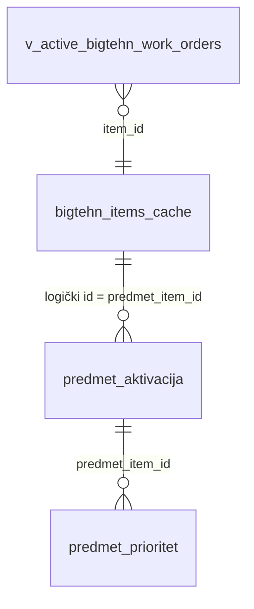

# Predmet aktivacija (Plan + Praćenje)

Jedinstven izvor istine za to **koji predmeti** (iz `bigtehn_items_cache`) ulaze u:

- **Plan proizvodnje** — preko `public.v_production_operations_effective` (filtar `je_aktivan`);
- **Praćenje proizvodnje** — `production.get_aktivni_predmeti()` vraća predmete koji su i u MES aktivnom skupu i **aktivirani** ovde.

Upravljanje: **Podešavanja → Podeš. predmeta** (admin + globalna `menadžment` u `user_roles`).  
`predmet_prioritet` i Faza 0/A RPC-ovi (`get_podsklopovi_predmeta`, itd.) ostaju nezavisni.

## „Aktivni skup B” (backfill)

Pri prvom deploy-u migracije, `je_aktivan = true` dobijaju predmeti čiji `item_id` postoji u aktivnim RN-ovima:

```sql
SELECT DISTINCT item_id::integer
FROM public.v_active_bigtehn_work_orders
WHERE item_id IS NOT NULL;
```

Svi ostali redovi u `bigtehn_items_cache` dobijaju `je_aktivan = false`.  
Ako je postojala `production.pracenje_oznaceni_predmeti`, njeni `predmet_item_id` su nakon toga **forcirani na `true`** (prioritet nad gore navedenim pravilom).

## Model

| Tabela | Uloga |
|--------|--------|
| `public.bigtehn_items_cache` | Poslovni predmeti (sync spolja). |
| `production.predmet_aktivacija` | Jedan red po `predmet_item_id` (PK), `je_aktivan`, `napomena`, audit. **Bez FK** ka cache-u. |
| `production.predmet_prioritet` | Redosled u Praćenju (Faza A), ne dirano osim što `set/shift` sada zahtevaju `je_aktivan`. |



## RPC / view

- `public.can_manage_predmet_aktivacija()` — `current_user_is_admin()` ILI `user_roles.role = 'menadzment'`.
- `public.list_predmet_aktivacija_admin()` / `public.set_predmet_aktivacija(...)` — PostgREST wrapperi.
- `public.v_production_operations` — proširena sa `item_id`; `v_production_operations_effective` join na `predmet_aktivacija`.
- **Trigger** `AFTER INSERT` na `bigtehn_items_cache` — upis `(id, je_aktivan=true)` sa `ON CONFLICT DO NOTHING`.

## Zamenjena `pracenje_oznaceni_predmeti`

Migracija `20260427160000__predmet_aktivacija_init.sql` briše `production.pracenje_oznaceni_predmeti` i RPC `pracenje_oznaci_predmet` / `pracenje_ukloni_oznaku`. Upravljanje je isključivo kroz Podešavanja + `set_predmet_aktivacija`.

## Poznata ograničenja

- **Brisanje predmeta iz `bigtehn_items_cache`** ne briše automatski red u `predmet_aktivacija` (mogu ostati „siroti” redovi; buduće čišćenje po potrebi).
- **SQL smoke** (`supabase/seeds/predmet_aktivacija_smoke.sql`): `list` / `set` proveravaju `can_manage_predmet_aktivacija()` → **mora JWT** (npr. `SET request.jwt.claims` u testu ili poziv preko PostgREST-a kao ulogovan korisnik). Goli `psql` kao `postgres` bez claim-a dobiće `forbidden`.

## Rollback

`20260427160000__predmet_aktivacija_init.down.sql` uklanja nove objekte i vraća `v_production_operations` bez `item_id`, rekreira praznu `pracenje_oznaceni_predmeti` i stare RPC-ove — **gubi se** sadržaj `predmet_aktivacija` i ne vraćaju se podaci stare whitelist tabele ako su obrisani u UP.
